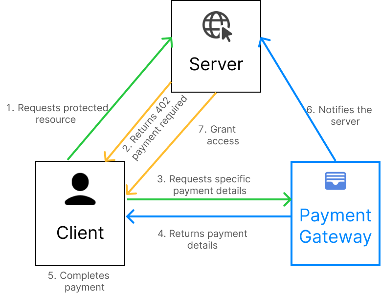

# **L402 Labs Website & L402 Protocol Launchpad**

L402 Labs official website and a demo launchpad for L402 protocol.

This project serves as both the public face of L402 Labs and a working example of how to implement the L402 (Lightning 402\) standard for metered, an\_d instant API payments.

## **The Launchpad: A Demo Environment**

The "Launchpad" demo provides a hands-on experience for users to:

1. Attempt to access a protected resource.  
2. Receive a 402 (Payment Required) challenge.  
3. Pay a Lightning invoice (in Sats) to mint a token.  
4. Use that token to gain access.

This demonstrates the core flow of L402 for "pay-as-you-go" access to digital services.

## **Architecture**

* **L402 Client**   
The website includes a simple L402 client implementation that connects to the L402 Gateway and a launchpad to handle payment challenges and token management.
  
* **L402 Gateway**  
The first production L402 payment gateway by L402 Labs that acts as the "paywall".  
  
* **L402 Server**  
The launchpad as a L402 service at backend simulates a protected resource that requires L402 payments for access.

## **License**

This project is licensed under the MIT License. See the LICENSE file for details.